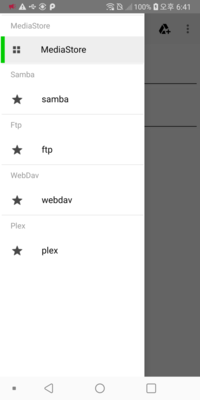
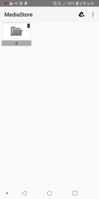
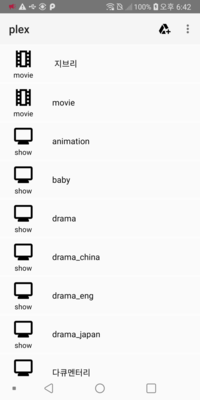
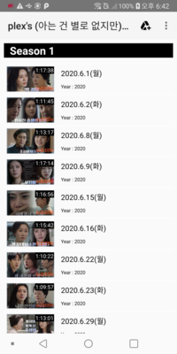
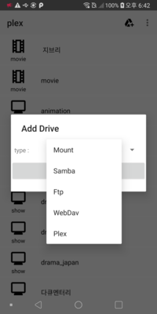

# sosoPlayer

소소하게 만들고 있는 안드로이드 미디어 플레이어 입니다

Exoplayer기반으로 개발하던 프로젝트입니다. 
현재는 리스트 쪽만 일부 구현 되어 있습니다.
Player 레이아웃은 exoplayer demo와 동일 합니다. (DataSourceFactory, MediaSourceFactory 만 변경 했습니다.)

 
  

## 주요 기능
extensions 를 통해 여러 기능을 제공 지원합니다.
 
### 0. SoSoPlayer
 extrastream 을 사용하는 플레이어 입니다.
 앞서 설명 드렸듯이 리스트 부분만 일부 구현 되어 있습니다.
 extensions 기능 참조용 데모라 보시면 될 듯 합니다.

### 1.extrastream 
samba, ftp, webdav를 지원하는 extensions 입니다.
DefaultDataSourceFactory 대신  samba, ftp, webdav 프로토콜 지원을 추가한  SosoDataSourceFactory 를 사용하시면 되며,
 
아래와 같이 ExtraStreamUri.java 통해 Uri를 재 작성시 Uri 뒤에 파라메터 형식으로 설정한 값이 추가되서 들어가며, 
extrastream 내부에서 이 값을 기준으로 서버에 접속합니다.

~~~
   Uri curUri = new ExtraStreamUri(IOType.Ftp, "실제 path")
      .setUserId("UserID"))
      .setPasswd("Passwd")
      .setHost("Host 경로")
      .setEncoding("Encoding 형식")
      .setPort("Port")
      .setActiveMode("activie mode 사용 여부").build();
~~~
 

- 수정 필요 부분
   * 안드로이드 보안이 강화되어 Secure(https, ftps, webdavs) 쪽 코드는 인증서 chain 부분을 추가 구현을 해야 할 수 있습니다.

### 2.ffmpeg2 
Exoplayer  extensions-ffmpeg의 경우 일부 오디오 디코딩만 지원하길래, 비디오 디코딩을 지원하게 수정한 extensions 입니다.
DefaultMediaSourceFactory 대신 SosoMediaSourceFactory를 사용하시면 ProgressiveMediaSource 대신 SosoMediaSource 를 사용합니다.

ffmpeg 소스는 빠져 있기 때문에, 
src/main/jni/ffmpeg 폴더에 ffmpeg 소스를 넣어주셔야 합니다.

* 수정 필요 부분
   * SosoMediaPeriod 사용 시 loadCondition 적용이 제대로 안되서 인지, Cronet extension 를 사용하면, Thread Interuppt Exception이 발생하기 때문에 다른 Data Source를 사용해야 합니다.
   * 오디오를 디코딩의 경우 편의상 2 channel, 16 bit 로 변환 되는데, 단말 사양에 따라 다운믹싱을 안하게 변경 해야 합니다.
   * 오디오가 디코딩의 경우 exoplayer구조상 선택되지 않는 트랙도 pcm으로 변환하는데, 비디오 디코딩 같이 패킷만 올리고, 실제 트랙 사용시 디코딩하는 구조로 변경해야 합니다.

### 3.plex 
Exoplayer와 의존관계가 전혀 없는 소스로,  plex api를 사용하여, plex 정보를 받아옵니다.

### 4.soso
Exoplayer에서 지원 못 하는 잡다한 부분을 뭉쳐 지원하려고 넣은 extension 입니다만.
현재는 smi파서만 지원됩니다. SosoDataSourceFactory 를 사용하시면 됩니다. 

* 수정 필요 부분
   * exoplayer 의 경우 charset encoding을 무조건 utf-8로 고정하고 있어서, 자동 dectecting 기능을 넣어 charset encoding 를 결정하고 있는데,
   사용자가 변경 가능하게 변경해야 할 필요가 있습니다. 

